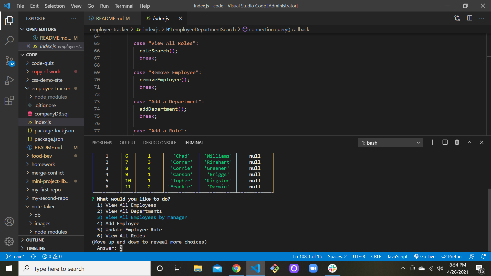

# Employee Tracker
  
## Description 
       This project allows users to track, add, remove and update employees based on roles and departments.
## Table of contents
  * [Description](#description)
  * [Installation](#installation)
  * [Usage](#usage)
  * [License](#license)
  * [Contributing](#contributing)
  * [Tests](#tests)
  * [Questions](#questions)
## Installation

          For this application you will need to start by forking the repository for this project from my github account listed below. Then opening it in your terminal. Once forked the user will need to install the necesary dependincies that are displayed in the package.json file. 
          
[GitHub Link](https://github.com/moecory11/employee-tracker)

## Usage 
          Once forked and dependencies installed. The user will enter "node index.js" in the terminal. The application will then begin with prompts to complete the variety of tasks available for each employee, role and depatment.
[Video of Application Usuage Link](https://drive.google.com/file/d/1Bt6Zk-83rTUuwsEjONdJvtloFzcrAoHD/view)
## License
          MIT
## Contributing
          
## Tests
          N/A
## Questions
   Any questions regarding this application please feel free to contact me at: 
      - E-mail moecory11@gmail.com
      - Github:
      <https://github.com/moecory11>